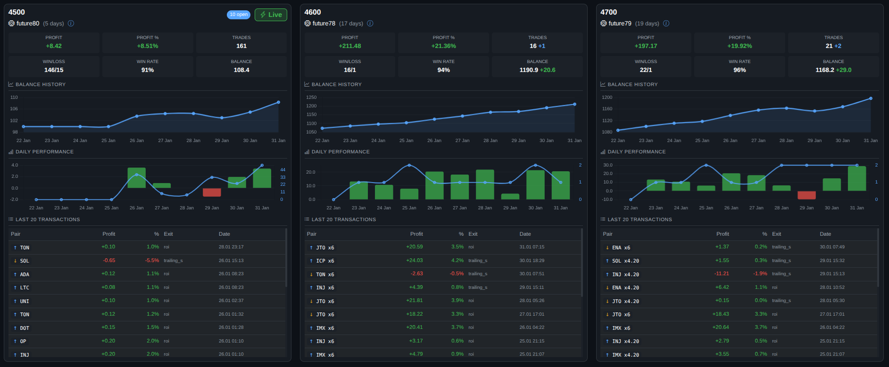
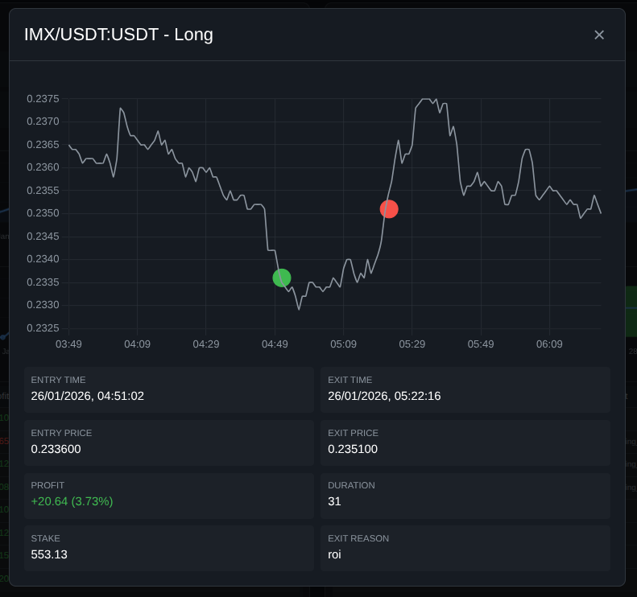
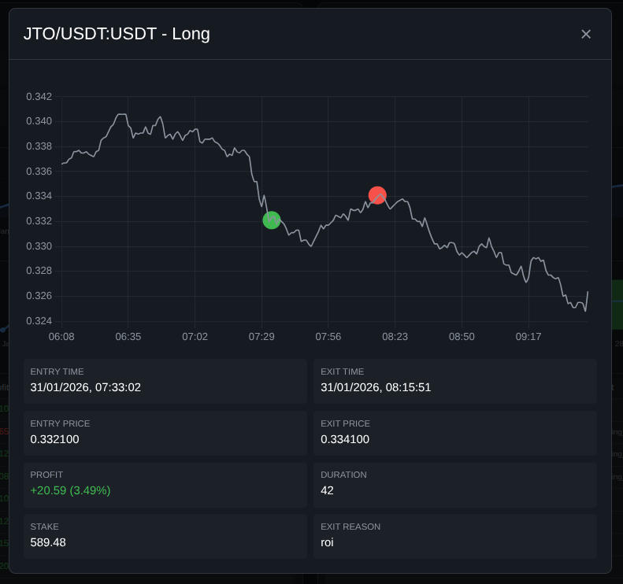

# freqmon

A PHP-based dashboard to monitor multiple FreqTrade trading bot instances from a single interface.

**[Live Demo](https://whitepaw.top/)** - Demo of my strategy fighting the crypto downfall



### Quick Trade View




## Features

- Aggregated Statistics - View total profit, trades, and win rate across all servers
- Server Overview Cards - Quick status view of each FreqTrade instance
- Performance Chart - Last 10 days profit/trade visualization with Chart.js
- Recent Transactions - Combined view of latest trades from all servers
- Open Trades Monitor - Track all currently open positions
- Auto-Refresh - Configurable auto-refresh interval
- Dark Theme - Easy on the eyes for 24/7 monitoring
- AJAX Live Updates - Real-time updates without page reload

## Requirements

- PHP 8.0+ with cURL extension
- Web server (Apache, Nginx, or PHP built-in server)
- FreqTrade instances with REST API enabled

## Installation

### 1. Clone or Download

```bash
# Create directory for the dashboard
mkdir /var/www/freqmon
cd /var/www/freqmon

# Copy files or clone from your repository
```

### 2. Configure Environment

```bash
# Copy example config
cp .env.example .env

# Edit with your server details
nano .env
```

### 3. Configure Your Servers

Edit `.env` file with your FreqTrade server details:

```env
# Format: SERVER_N=name|host:port|username|password|url (url is optional)

SERVER_1=Future55|192.168.10.100:4100|freqtrader|your_password
SERVER_2=Future60|192.168.10.100:4200|freqtrader|your_password
# With URL (server name becomes a clickable link):
SERVER_3=Future65|192.168.10.100:4300|freqtrader|your_password|https://www.bybit.com/copyTrade/trade-center/detail?leaderMark=xxx

# Dashboard Settings
REFRESH_INTERVAL=60      # Auto-refresh interval in seconds
CACHE_TTL=30             # Cache time-to-live in seconds
TIMEZONE=Europe/Berlin   # Timezone for date display

# UI Settings
SUMMARY=OFF              # Show summary stats bar at top (ON/OFF, default: OFF)
SOUND=ON                 # Play chime sound for new trade notifications (ON/OFF, default: ON)
DAYS=20                  # Number of days to show in charts (default: 20)
NOTIFY=10                # Duration in seconds to show activity star after new trades (default: 10)

# Security
PASSWORD=your_password   # Password protection for dashboard access (optional, leave empty to disable)
```

### 4. FreqTrade API Configuration

Ensure each FreqTrade instance has the REST API enabled in `config.json`:

```json
{
    "api_server": {
        "enabled": true,
        "listen_ip_address": "0.0.0.0",
        "listen_port": 4100,
        "verbosity": "error",
        "jwt_secret_key": "your-random-secret-key",
        "username": "freqtrader",
        "password": "your_password"
    }
}
```

**Security Note**: Only expose the API within your private network. Use VPN or SSH tunnels for remote access.

### 5. Start the Dashboard

**Option A: PHP Built-in Server (Development)**

```bash
cd /var/www/freqmon
php -S 0.0.0.0:8888
```

**Option B: Apache**

```apache
<VirtualHost *:80>
    ServerName freqmon.local
    DocumentRoot /var/www/freqmon

    <Directory /var/www/freqmon>
        AllowOverride All
        Require all granted
    </Directory>
</VirtualHost>
```

**Option C: Nginx**

```nginx
server {
    listen 80;
    server_name freqmon.local;
    root /var/www/freqmon;
    index index.php;

    location ~ \.php$ {
        fastcgi_pass unix:/var/run/php/php8.1-fpm.sock;
        fastcgi_param SCRIPT_FILENAME $document_root$fastcgi_script_name;
        include fastcgi_params;
    }
}
```

## File Structure

```
freqmon/
├── .env.example        # Configuration template
├── .env                # Your configuration (create this)
├── index.php           # Main dashboard with AJAX updates
├── api.php             # JSON API endpoint
├── debug.php           # Debug utility for testing API connections
├── README.md           # This file
└── src/
    ├── Config.php          # Configuration loader
    ├── Dashboard.php       # Dashboard data aggregator
    └── FreqtradeClient.php # FreqTrade API client
```

## FreqTrade API Endpoints Used

| Endpoint | Description |
|----------|-------------|
| `/api/v1/ping` | Health check |
| `/api/v1/token/login` | JWT authentication |
| `/api/v1/profit` | Profit summary |
| `/api/v1/daily` | Daily performance |
| `/api/v1/trades` | Trade history |
| `/api/v1/status` | Open trades |
| `/api/v1/balance` | Account balance |
| `/api/v1/show_config` | Bot configuration |
| `/api/v1/count` | Trade count |

## Troubleshooting

### Server Shows Offline

1. Check if FreqTrade is running: `docker ps` or `systemctl status freqtrade`
2. Verify API is enabled in FreqTrade config
3. Test connection: `curl http://SERVER_IP:PORT/api/v1/ping`
4. Check firewall rules

### Authentication Failed

1. Verify username/password in `.env`
2. Ensure credentials match FreqTrade `config.json`
3. Check for special characters in password (may need escaping)

### No Data Displayed

1. Check PHP error logs
2. Verify cURL extension is installed: `php -m | grep curl`
3. Test API manually with curl

## Security Recommendations

1. **Never expose the dashboard directly to the internet**
2. Use a VPN or SSH tunnel for remote access
3. Enable HTTPS if accessible outside localhost
4. Use strong, unique passwords for each FreqTrade instance
5. Enable dashboard password protection by setting `PASSWORD` in `.env`

## License

MIT License - feel free to use and modify as needed.

## Credits

- [FreqTrade](https://github.com/freqtrade/freqtrade) - The trading bot
- [Bootstrap 5](https://getbootstrap.com/) - CSS framework
- [Chart.js](https://www.chartjs.org/) - Charts library
- [Bootstrap Icons](https://icons.getbootstrap.com/) - Icons
